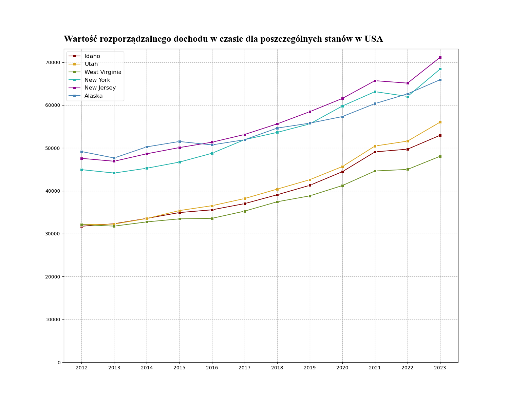
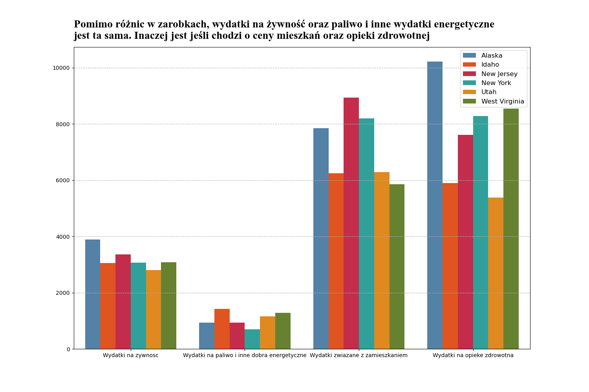
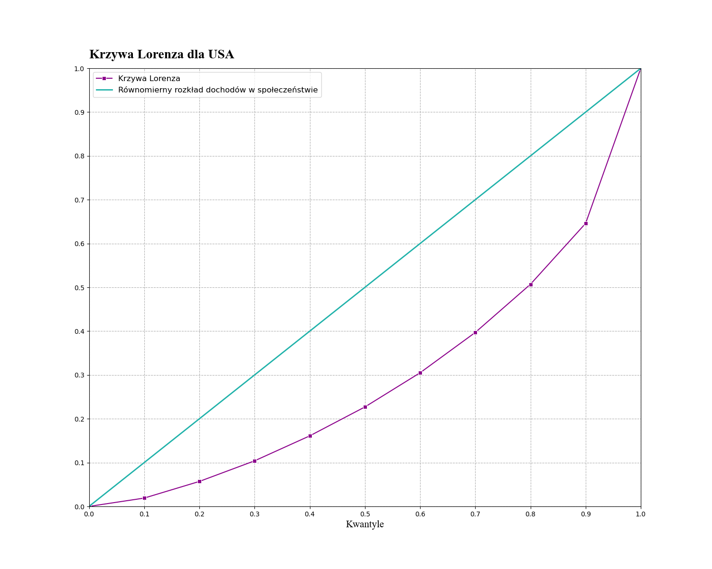

# Expenditures in USA - analysis
## Table of contents
* [Description](#Description)
* [Technologies](#Technologies)
* [Installation](#Installation)
* [Data](#Data)
* [Results](#Results)
## Description
This project compares structure of expenditures and incomes across selected US states. It focuses on analysing the inequalities between states with high and low personal disposable income. The analysis is based on Python script which you can run in your own Jupyter Notebook.

<p align="center">
  
</p>

## Technologies
To analyse, we used MS Excel and the following Python libraries:
* Pandas
* Numpy
* Matplotlib
* Seaborn
## Installation
If it's your first time using Python in data analysis and visualisation, you can install the required libraries by running this command in your Jupyter Notebook:
```
!pip install pandas numpy matplotlib seaborn
```
## Data
The data used in this project comes from The Bureau of Economic Analysis (BEA). You can find the raw files in the repository.
## Results
Key findings:
* **Basic necessities**: expenditures on food and energy goods remains at a relatively similar level across all the states,
* **Housing**: housing costs differ significantly from state to state,
* **Healthcare**: healthcare spending is consistently high regardless of the state, which may act as a barrier to proper treatment for lower-income groups.
<p align="center">
  
</p>

**Wealth inequality**: housing and healthcare expenditures are the primary drivers for inequality. The Lorenz Curve, which illustrates the wealth distribution in USA, supports that statement.
<p align="center">
  
</p>

